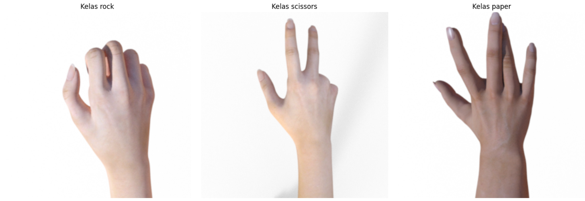
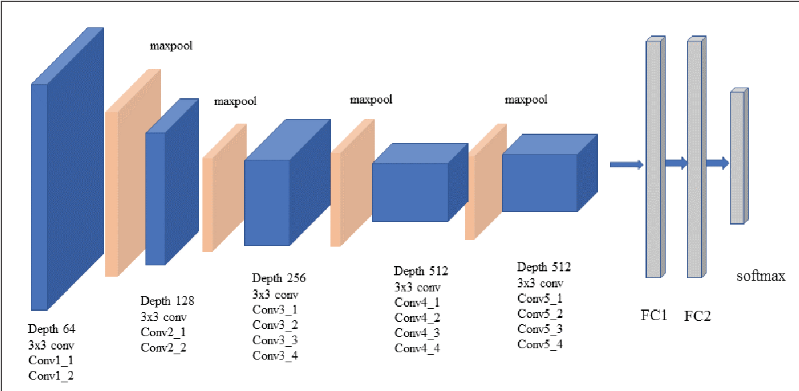
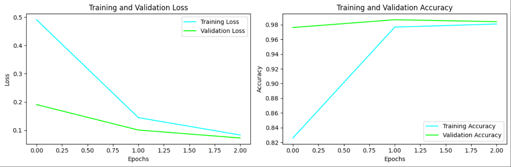
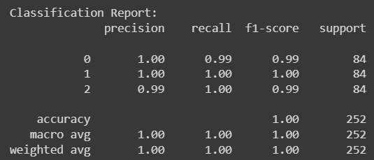
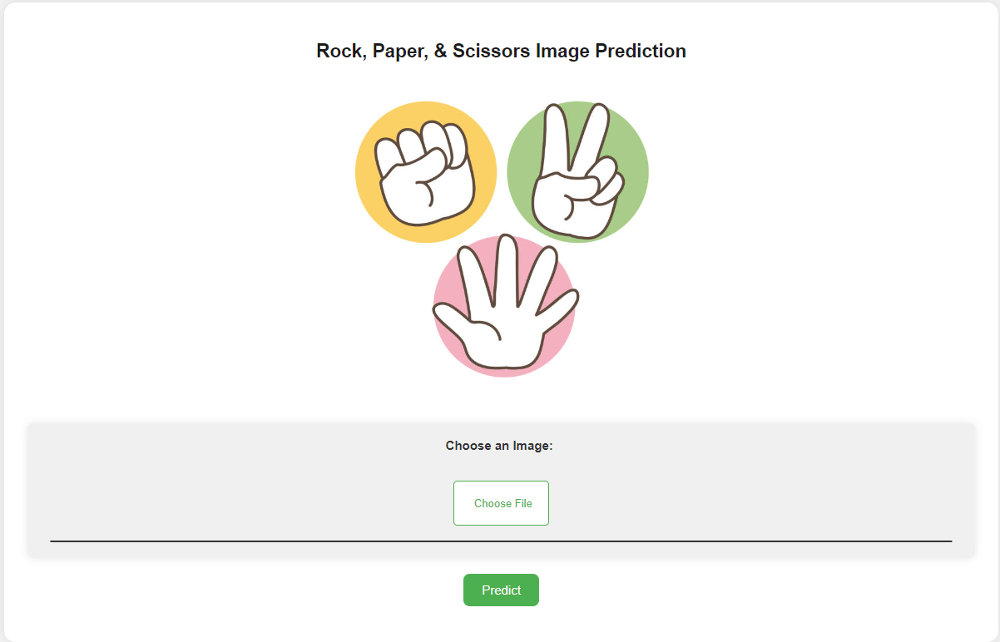
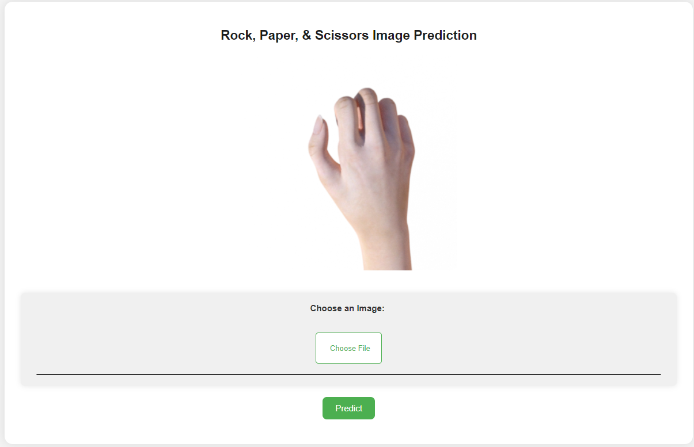
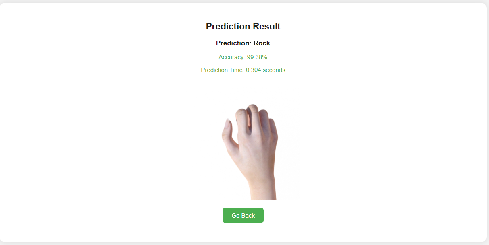

# 
Rock, Paper, Scissors Prediction

This project focuses on creating a deep learning model to predict images of rock, paper, and scissors.

## Table Of Content
1. [**Introduction**](https://github.com/anandaallif/RPS-AI-Web-Deployment_329/edit/main/README.md#introduction)
2. [**Features**](https://github.com/anandaallif/RPS-AI-Web-Deployment_329/edit/main/README.md#features)
3. [**Dataset**](https://github.com/anandaallif/RPS-AI-Web-Deployment_329/edit/main/README.md#dataset)
4. [**Requierments**](https://github.com/anandaallif/RPS-AI-Web-Deployment_329/edit/main/README.md#requierments)
5. [**VGG-19**](https://github.com/anandaallif/RPS-AI-Web-Deployment_329/edit/main/README.md#vgg-19)
6. [**Pre Processing & Modelling**](https://github.com/anandaallif/RPS-AI-Web-Deployment_329/edit/main/README.md#pre_processing_&_modelling)
7. [**AI Web Deployment**](https://github.com/anandaallif/RPS-AI-Web-Deployment_329/edit/main/README.md#ai_web_deployment)
8. [**Authors**](https://github.com/anandaallif/RPS-AI-Web-Deployment_329/edit/main/README.md#authors)

## Introduction
The goal of this project is to create an accurate and robust image classification model for the classic rock-paper-scissors game. The model is trained on a diverse dataset containing a total of 2520 images, with an equal distribution of 840 images for each class: rock, paper, and scissors. This dataset ensures that the model is well-balanced and capable of handling a variety of real-world scenarios.

## Features
- **Deep Learning Model:** Utilizes state-of-the-art deep learning techniques for image prediction.
- **Dataset:** A comprehensive dataset with a balanced distribution of images for each class.
- **Predictive Power:** The model is designed to accurately predict the class of new images of rock, paper, or scissors.

## Dataset
This dataset comprises 2520 images categorized into three classes: paper, rock, and scissors. Each class contains 840 images.

[**Access Dataset Here !**](https://drive.google.com/file/d/1u_iS39-nPsJMmp5ZS1X4_nrzUvFeEYaw/view?usp=sharing)

## Requierments
* Python 3
* Flask
* OpenCV
* NumPy
* TensorFlow
* Pillow

## VGG-19
VGG-19 (Visual Geometry Group 19) is a convolutional neural network (CNN) architecture that belongs to the VGG family of models. It was introduced by the Visual Geometry Group at the University of Oxford and has gained popularity for its simplicity and effectiveness in image classification tasks.

## Pre Processing & Modelling
* Splitting Dataset

  ~~~
  splitfolders.ratio(dataset_folder_path,
                   output=hasil_splitting,
                   ratio=(0.75, 0.15, 0.10),
                   group_prefix=None)
* Pre Processing
  
  ~~~
  Datagen = ImageDataGenerator(rescale=1./255,rotation_range=30,zoom_range=0.2,horizontal_flip=True, fill_mode='nearest')
  Datagen_Test = ImageDataGenerator(rescale=1./255,)

* Graph Loss & Accuracy
  
* Classification Report
  

## AI Web Deployment
* Main Page
  
  
  
* Result Page

  

## Author
* **Ananda Allif Agita** ***([@anandaallif](https://github.com/anandaallif))***
